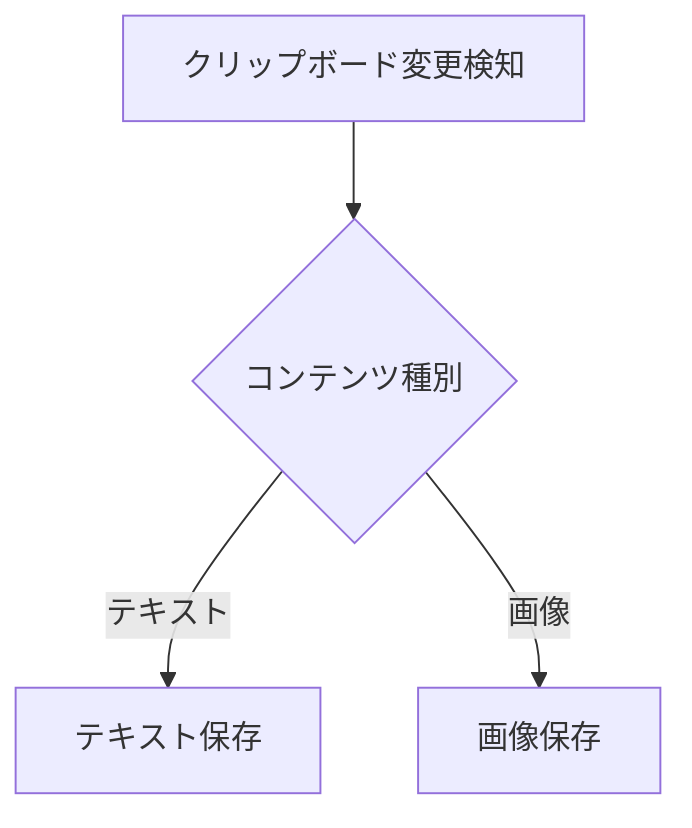

# design/ ディレクトリガイド

cbプロジェクト（macOSクリップボードマネージャー）の設計ドキュメントを管理するガイド。

---

## 1. 目的

コードの構造・設計パターンを文書化する。

**対象読者**: AIエージェント（主）、開発者（副）

**文書化の方針**:
- コードの構造・設計パターンを正確に記録
- 将来の拡張ポイント → ADR として判断理由と代替案を記録
- コードと文書の乖離が生じた場合 → コードを正とし、文書を更新

**実装ステータスに関する原則**:

設計書（`modules/`, `flows/`, `decisions/`）に実装ステータス（「未実装」「実装済み」「Phase N で対応予定」等）を記載してはならない。設計書はコードの**あるべき姿**を記述するものであり、実装の進捗管理は `docs/plans/` と `docs/issues/` の役割である。

- **禁止**: 「未実装」「実装済み」「Phase N」「将来対応予定」「将来的に〜」などの時間依存の記述
- **許可**: 「スコープ外」「本モジュールでは扱わない」などの設計上の境界定義
- **許可**: 「拡張ポイント」「代替案として検討可能」などの設計上の選択肢の記録（ADR内）
- **例外**: `usecase_mapping/` のカバレッジ列のみ、実装状態の追跡を許可する

---

## 2. ディレクトリ構成

```
docs/design/
├── GUIDE.md                              # 本ファイル
├── TEMPLATE.md                           # 汎用テンプレート
├── modules/                              # モジュール別設計書
│   └── (モジュール追加時に作成)
├── flows/                                # 処理フロー図
│   └── (フロー追加時に作成)
├── decisions/                            # アーキテクチャ決定記録（ADR）
│   ├── 001-technology-stack.md           # 技術スタック選定
│   └── 002-ui-design-system.md           # UIデザインシステム（Liquid Glass）
└── usecase_mapping/                      # ユースケースと実装の対応表
    └── (ユースケース追加時に作成)
```

---

## 3. 設計書の種類と役割

### 3.1 モジュール設計書 (`modules/`)

**目的**: 各モジュールの内部設計を詳細に記述

**含めるべき内容**:
- モジュールの責務と境界
- 公開API（主要な構造体・プロトコル・クラス）
- 内部実装の詳細（アルゴリズム、データ構造）
- 依存関係（他モジュールとの関係）
- テストカバレッジと重要なテストケース

**対象読者**: 実装を理解・修正する開発者、詳細な動作を把握したいAIエージェント

### 3.2 フロー設計書 (`flows/`)

**目的**: 処理の流れを可視化

**含めるべき内容**:
- エンドツーエンドの処理フロー（シーケンス図、フローチャート）
- 各ステップでの入出力
- モジュール間の呼び出し関係
- エラーハンドリングのパス

**対象読者**: システム全体の動作を理解したい開発者、デバッグを行うAIエージェント

### 3.3 ユースケースマッピング (`usecase_mapping/`)

**目的**: ユースケースと実装の対応関係を明確化

**含めるべき内容**:
- `docs/usecases/` で定義された各ユースケースに対応する実装箇所
- ユースケースのカバレッジ（実装ステータスの追跡はこの種別のみ許可）
- 実装とユースケースの齟齬がある場合の記録

**対象読者**: ユースケースを実装・検証する開発者、機能の網羅性を確認するAIエージェント

### 3.4 設計判断記録 (`decisions/`)

**目的**: 主要な設計判断とその根拠を記録（ADR形式）

**含めるべき内容**:
- 採用した設計方針とその理由
- 検討した代替案
- トレードオフの分析
- 設計上のスコープ境界

**対象読者**: 設計の背景を理解したい開発者、設計判断の根拠を把握したいAIエージェント

---

## 4. 種別ごとのセクション取捨選択表

TEMPLATE.md の全セクションに対し、種別ごとの必須/任意/不要を示す。不要なセクションは削除して使用する。

| セクション | modules | flows | decisions | usecase_mapping |
|-----------|---------|-------|-----------|-----------------|
| メタデータコメント | 必須 | 必須 | 必須 | 必須 |
| 概要 | 必須 | 必須 | 必須 | 必須 |
| 責務と境界 | 必須 | 不要 | 不要 | 不要 |
| 公開API | 必須 | 不要 | 不要 | 不要 |
| 内部設計 | 必須 | 不要 | 不要 | 不要 |
| データ構造 | 任意 | 任意 | 不要 | 不要 |
| アルゴリズム | 任意 | 任意 | 不要 | 不要 |
| 処理フロー | 任意 | 必須 | 不要 | 任意 |
| エラーハンドリング | 必須 | 任意 | 不要 | 任意 |
| ユースケース対応 | 任意 | 不要 | 不要 | 必須 |
| テスト | 必須 | 任意 | 不要 | 任意 |
| 制約・スコープ境界 | 任意 | 任意 | 不要 | 任意 |
| 設計判断（ADR） | 任意 | 不要 | 必須 | 不要 |
| 関連ドキュメント | 必須 | 必須 | 必須 | 必須 |

---

## 5. 記法規約

### Mermaid図

処理フローにはMermaid記法を使用する。

```markdown

```

### コード参照形式

ファイルパスと関数名で特定箇所を示す。行番号はコード変更で陳腐化するため、関数名を優先する。

```markdown
`ClipboardManager.startMonitoring()`（`Sources/CB/ClipboardManager.swift`）
```

### コードスニペット

- **10行以内**: インライン記載（ソース位置をコメントで注記）
- **11行以上**: 参照リンクのみ + 要点を箇条書き

### 相互参照

相対パスで参照する。

```markdown
- [クリップボードフロー](./flows/clipboard_flow.md)
- [技術スタック ADR](./decisions/001-technology-stack.md)
- [初期仕様書](../archive/initial_plan.md)
```

---

## 6. AIエージェント向けルール

### 調査の深さ

| レベル | 対象 | 深さ | 例 |
|--------|------|------|-----|
| **浅い** | 公開API | 関数シグネチャのみ | `func startMonitoring()` |
| **中程度** | 主要な実装 | アルゴリズムの概要 | "NSPasteboardの変更カウントを監視して差分を検出" |
| **深い** | 複雑なロジック | 詳細な実装とエッジケース | エラーハンドリング、境界値処理 |

**原則**: **必要最小限の深さで調査する**。

### テストケースの参照

実装の理解を深めるため、**テストケースを積極的に参照する**。

### 設計書の作成手順

1. 対象コードを読み、公開API・内部構造・テストケースを把握する
2. TEMPLATE.md をコピーし、種別に応じて不要セクションを削除する
3. メタデータコメントを記入する
4. コード参照形式に従い、関数名・ファイルパスを正確に記載する
5. 品質チェックリスト（後述）で確認する

### 注意事項

- 空セクションを残さない
- コードと文書が矛盾する場合、コードを正とする
- 設計書に実装ステータスを記載しない（1章の原則を参照）
- 推測や仮定を事実として記載しない

---

## 7. テンプレートの使用方法

1. [TEMPLATE.md](./TEMPLATE.md) をコピーして新規ファイルを作成する
2. メタデータコメントの種別・対象・日付を記入する
3. セクション取捨選択表（4章）に従い、不要セクションを削除する
4. 各セクションの内容を記述する
5. 空セクションが残っていないか確認する

### ファイル命名規則

| 種別 | 命名規則 | 例 |
|------|---------|-----|
| modules | `{モジュール名}.md`（小文字） | `clipboard-manager.md`, `storage.md` |
| flows | `{処理名}_flow.md`（小文字） | `clipboard_flow.md` |
| decisions | `{3桁番号}-{kebab-case}.md` | `001-technology-stack.md` |
| usecase_mapping | `{機能名}.md`（小文字） | `clipboard-operations.md` |

---

## 8. 品質チェックリスト

- [ ] メタデータコメントが記入されている
- [ ] 種別に応じた必須セクションがすべて含まれている
- [ ] 不要セクション・空セクションが残っていない
- [ ] コード参照が正確（関数名・ファイルパス）
- [ ] Mermaid図が正しい記法で記述されている
- [ ] 相互参照の相対パスが正しい
- [ ] 実装ステータスが含まれていない
- [ ] 関連ドキュメントセクションにリンクが記載されている

---

## 9. 参考資料

- [ユースケースガイド](../usecases/GUIDE.md): ユーザー向けドキュメントの規約
- [実装計画ガイド](../plans/GUIDE.md): 実装計画の規約

---

## 10. 更新履歴

| 日付 | 内容 |
|------|------|
| 2026-02-15 | 初版作成 |
