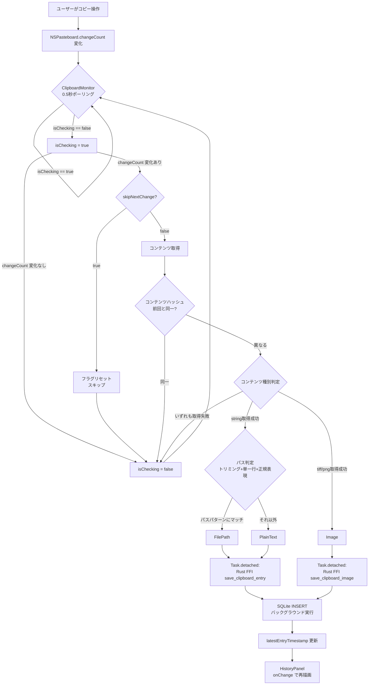

<!--
種別: flows
対象: クリップボード監視・保存フロー
作成日: 2026-02-16
更新日: 2026-02-16
担当: AIエージェント
-->

# クリップボード監視・保存フロー

## 概要

ユーザーがテキストや画像をコピーしてから、SQLiteに保存されUIが更新されるまでのエンドツーエンドフロー。

---

## 処理フロー

## 各ステップの詳細

### 1. ポーリング（ClipboardMonitor）

`Timer.scheduledTimer(withTimeInterval: 0.5)`で`NSPasteboard.general.changeCount`を前回値と比較。

### 2. セルフループ防止

`PasteService.copyToClipboard()`実行時に`monitor.skipNextChange = true`を設定。次のchangeCount変化を1回だけスキップし、自分自身のペーストを履歴に再保存しない。

### 3. 重複検出

コンテンツの`hashValue`を前回と比較。同一コンテンツの連続コピーをスキップ。

### 4. コンテンツ種別判定

| 優先度 | 条件 | 種別 |
|--------|------|------|
| 1 | `pasteboard.string(forType: .string)` 取得成功 | PlainText / FilePath |
| 2 | `pasteboard.data(forType: .tiff)` 取得成功 | Image |
| 3 | `pasteboard.data(forType: .png)` 取得成功 | Image |

テキストが取得できる場合はテキストを優先（画像を含むコピーでもテキスト表現がある場合がある）。

### 5. FFI呼び出し → SQLite保存

`Task.detached` でバックグラウンドスレッドからRust FFI関数を呼び出し、StorageシングルトンのMutexをロックしてSQLCipher暗号化SQLite INSERTを実行。メインスレッドをブロックしない設計。`created_at`は`SystemTime::now()`のUnixタイムスタンプ。DBは`init_storage(dbPath, encryptionKey)`で暗号化キー付きで初期化済み。

---

## 関連ドキュメント

- [cb-core モジュール設計](../modules/cb-core.md)
- [UI モジュール設計](../modules/ui.md)
- [ペーストフロー](./paste_flow.md)
