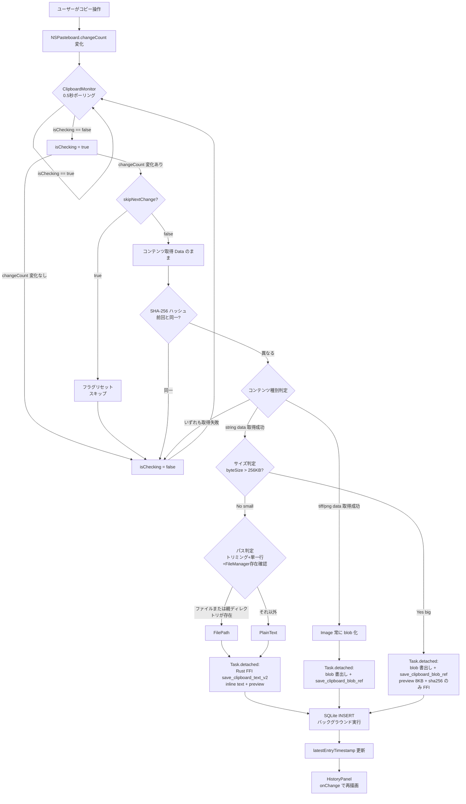

<!--
種別: flows
対象: クリップボード監視・保存フロー
作成日: 2026-02-16
更新日: 2026-02-16
担当: AIエージェント
-->

# クリップボード監視・保存フロー

## 概要

ユーザーがテキストや画像をコピーしてから、SQLiteに保存されUIが更新されるまでのエンドツーエンドフロー。

---

## 処理フロー

```mermaid
flowchart TD
    A[ユーザーがコピー操作] --> B[NSPasteboard.changeCount 変化]
    B --> C{ClipboardMonitor<br/>0.5秒ポーリング}
    C -->|isChecking == true| C
    C -->|isChecking == false| C2[isChecking = true]
    C2 -->|changeCount 変化なし| C3[isChecking = false]
    C3 --> C
    C2 -->|changeCount 変化あり| D{skipNextChange?}
    D -->|true| E[フラグリセット<br/>スキップ]
    E --> C3
    D -->|false| F[コンテンツ取得 Data のまま]
    F --> G{SHA-256 ハッシュ<br/>前回と同一?}
    G -->|同一| C3
    G -->|異なる| H{コンテンツ種別判定}
    H -->|string data 取得成功| S{サイズ判定<br/>byteSize > 256KB?}
    S -->|Yes big| BIG[Task.detached:<br/>blob 書出し + save_clipboard_blob_ref<br/>preview 8KB + sha256 のみ FFI]
    S -->|No small| I{パス判定<br/>トリミング+単一行+FileManager存在確認}
    I -->|ファイルまたは親ディレクトリが存在| J[FilePath]
    I -->|それ以外| K[PlainText]
    H -->|tiff/png data 取得成功| L[Image 常に blob 化]
    H -->|いずれも取得失敗| C3
    J --> M[Task.detached:<br/>Rust FFI save_clipboard_text_v2<br/>inline text + preview]
    K --> M
    L --> N[Task.detached:<br/>blob 書出し + save_clipboard_blob_ref]
    M --> O[SQLite INSERT<br/>バックグラウンド実行]
    N --> O
    BIG --> O
    O --> P[latestEntryTimestamp 更新]
    P --> Q[HistoryPanel<br/>onChange で再描画]
```

## 各ステップの詳細

### 1. ポーリング（ClipboardMonitor）

`Timer.scheduledTimer(withTimeInterval: 0.5)`で`NSPasteboard.general.changeCount`を前回値と比較。

### 2. セルフループ防止

`PasteService.copyToClipboard()`実行時に`monitor.skipNextChange = true`を設定。次のchangeCount変化を1回だけスキップし、自分自身のペーストを履歴に再保存しない。

### 3. 重複検出

コンテンツの **SHA-256** を前回値 `lastContentSha` と比較。同一コンテンツの連続コピーをスキップ。以前は `String.hashValue` を使っていたが、衝突可能性・プロセス間非決定性があったため sha256 に変更 (PR #18)。

### 4. コンテンツ種別判定

| 優先度 | 条件 | 種別 |
|--------|------|------|
| 1 | `pasteboard.data(forType: .string)` 取得成功 | PlainText / FilePath |
| 2 | `pasteboard.data(forType: .tiff)` 取得成功 | Image |
| 3 | `pasteboard.data(forType: .png)` 取得成功 | Image |

テキストが取得できる場合はテキストを優先（画像を含むコピーでもテキスト表現がある場合がある）。`NSPasteboard` へのアクセスは MainActor 縛りのため Data 取得だけ MainActor で行い、以降 (hash 計算 / blob 書き込み / FFI) はすべて `Task.detached` に退避する。

### 5. サイズ判定と blob 外部化 (PR #17/#18)

- テキスト: `byteSize > TEXT_EXTERNALIZE_THRESHOLD_BYTES (256KB)` なら「大サイズ」扱い
  - フル `String` 化せず `Data` のまま `<blob_dir>/<sha256>.bin` に書き出し
  - FFI は `save_clipboard_blob_ref(contentType, preview 8KB, sha256, byte_size, sourceApp)` に preview + 参照のみ渡す
- テキスト: 閾値以下なら `save_clipboard_text_v2(contentType, preview, fullText, "", byte_size, sourceApp)` に inline テキストを渡す
- 画像: **常に blob 化**。`save_clipboard_blob_ref("Image", "", sha256, byte_size, sourceApp)`
- `blob_dir` は `blob_dir_path()` FFI で取得する

`text_preview` は最大 8KB (`PREVIEW_BYTES_LIMIT` in Swift、`PREVIEW_BYTES` in Rust) で FTS5 索引対象になる。8KB を超える本文の部分は検索できない。

### 6. FFI呼び出し → SQLite保存

`Task.detached` でバックグラウンドスレッドから Rust FFI 関数を呼び出し、Storage シングルトンの Mutex をロックして SQLCipher 暗号化 SQLite INSERT を実行。メインスレッドをブロックしない設計。`created_at` は `SystemTime::now()` のミリ秒単位 Unix タイムスタンプ。DB は `init_storage(dbPath, encryptionKey)` で暗号化キー付きで初期化済み。旧 FFI (`save_clipboard_entry` / `save_clipboard_image`) は Rust 側で自動 externalize するので BC 用途で残存しているが、Swift 側は blob-first の新 FFI (v2 / blob_ref) のみ使う。

---

## 関連ドキュメント

- [cb-core モジュール設計](../modules/cb-core.md)
- [UI モジュール設計](../modules/ui.md)
- [ペーストフロー](./paste_flow.md)
