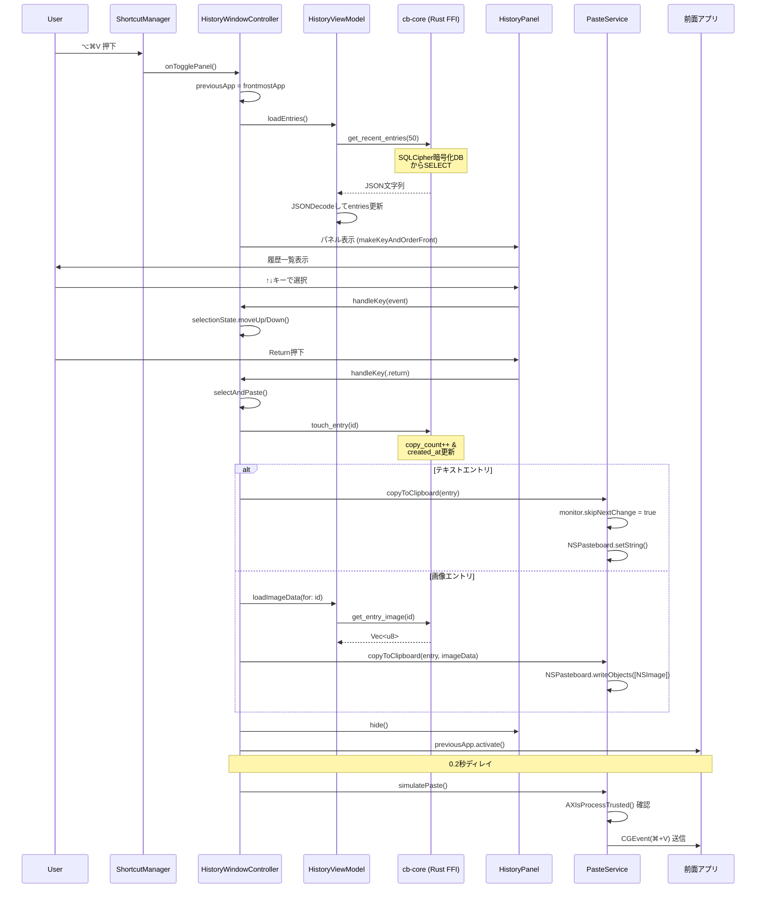

<!--
種別: flows
対象: ペースト操作フロー
作成日: 2026-02-16
更新日: 2026-02-16
担当: AIエージェント
-->

# ペースト操作フロー

## 概要

ユーザーがグローバルショートカットで履歴パネルを開き、エントリを選択してアクティブアプリにペーストするまでのフロー。

---

## 処理フロー

## 各ステップの詳細

### 1. ホットキーコールバック

Carbon Event Managerが⌥⌘Vを検知 → グローバル変数`_shortcutManagerInstance`経由で`handleHotKey()` → `onTogglePanel`クロージャ呼び出し。

### 2. パネル表示

`HistoryWindowController.show()`:
1. `NSWorkspace.shared.frontmostApplication` を `previousApp` に記憶
2. `viewModel.loadEntries()` で最新50件をRust FFI経由で取得
3. 選択インデックスを0にリセット
4. パネルを画面中央やや上（垂直10%オフセット）に配置
5. `NSApp.activate(ignoringOtherApps: true)` でアプリをアクティブ化

### 3. キーボードナビゲーション

`KeyablePanel.sendEvent()`でキーコード126(↑), 125(↓), 36(Return), 53(Esc)をインターセプト。SwiftUIのTextFieldに到達する前に処理する。

### 4. ペースト実行

1. `PasteService.copyToClipboard()` — NSPasteboardにコンテンツ設定
2. `monitor.skipNextChange = true` — セルフループ防止
3. パネル非表示
4. `previousApp.activate()` — 元のアプリをアクティブ化
5. **0.2秒ディレイ** — アプリのアクティベーション完了を待つ
6. `PasteService.simulatePaste()` — CGEventで⌘+Vを送信

### 5. アクセシビリティ要件

`simulatePaste()`は`AXIsProcessTrusted()`がtrueの場合のみ動作。未許可の場合はサイレントスキップ。

---

## 関連ドキュメント

- [UI モジュール設計](../modules/ui.md)
- [クリップボード監視フロー](./clipboard_flow.md)
